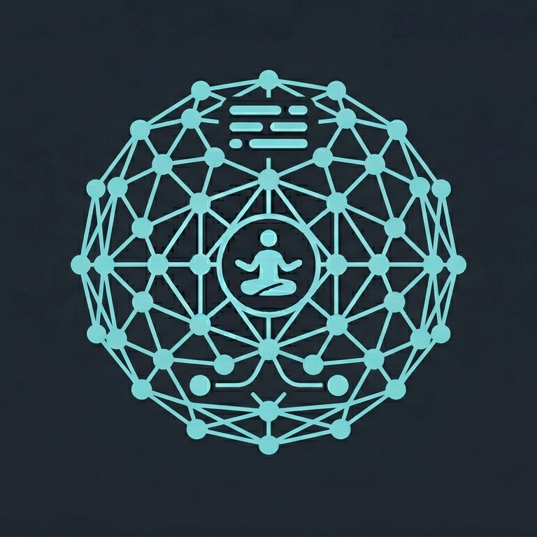

# flowstate

<p align="center">
  
</p>

<p align="center">
  <b>One desktop app. Many agents. One orchestrator.</b><br/>
  Chat with Claude, Codex, GitHub Copilot and OpenCode from a single
  place — and let them spawn, message, and supervise each other.
</p>

---

Flowstate is a Tauri desktop app built on top of a Rust agent runtime.
It treats agents as first-class, orchestratable primitives: any live
agent can spawn another agent, wait for its reply, poll for progress,
or fan work out across git worktrees — all through a small MCP tool
surface exposed to every provider.

## Highlights

- **Multi-provider.** Claude (Agent SDK + CLI), Codex, GitHub Copilot
  (SDK + CLI), and OpenCode — all behind the same `ProviderAdapter`
  trait.
- **Agent orchestration built in.** `spawn`, `send`, `spawn_and_await`,
  `send_and_await`, `poll`, `read_session` — exposed as MCP tools
  (`mcp__flowstate__*`) that any agent can call mid-turn.
- **Safe by construction.** Cycle detection on the await graph,
  per-turn orchestration budget, max await depth, and per-session
  mailboxes prevent runaway fan-out and deadlocks.
- **Worktree-native.** `create_worktree` + `spawn_in_worktree` let an
  agent provision an isolated git worktree and start a sub-agent in it
  in one call.
- **Transport-agnostic core.** The runtime doesn't know whether it's
  running in-process behind Tauri IPC, over HTTP+WebSocket, or in a
  test harness.

## Install

Grab the latest build for your platform from
[Releases](https://github.com/seg4lt/flowstate/releases/latest):

- **macOS (Apple Silicon)** — `Flowstate-<version>-macos-arm64.dmg`

Windows and Linux builds are temporarily paused — the matrix rows are
kept commented in `.github/workflows/build.yml` and can be re-enabled
without further changes.

On macOS, open the DMG and double-click **Install Flowstate.command**
to copy the app to `/Applications` and clear the quarantine flag.

## Screenshots

> Screenshots of the running app live under `docs/screenshots/` and
> are captured with `axctl screenshot flowstate --mode app`. See
> [`docs/screenshots/README.md`](docs/screenshots/README.md) for the
> shot list and capture commands.

<!--
The images below are committed once captured. Wiring stays here so we
don't touch the README when they land.


-->

## Architecture

```
     apps/flowstate/              Tauri shell (Rust + React)
              │
              ▼
      crates/middleman/           Transport + lifecycle
       transport-tauri            (in-process IPC)
       transport-http             (HTTP+WS, archived)
              │
              ▼
        crates/core/              Domain — transport-agnostic
          runtime-core            Session state machine, orchestrator
          provider-api            RuntimeCall / Result wire protocol
          persistence             Session + turn history
          checkpoints             Snapshot + restore
          usage-store             Token/cost accounting
          provider-claude-sdk     Claude via Agent SDK subprocess
          provider-claude-cli     Claude via `claude` binary
          provider-codex          OpenAI Codex CLI
          provider-github-copilot GitHub Copilot SDK
          provider-github-copilot-cli   `gh copilot` CLI
          provider-opencode       OpenCode
          embedded-node           Bundled Node runtime for SDK bridges
```

**Dependency direction:** `apps/*` → `middleman/*` → `core/*`. Core
never depends on middleman or apps. No cycles.

## Agent orchestration

Every agent is given an MCP toolset that lets it drive the runtime
directly. The runtime validates and dispatches the call, updates the
session graph, and returns a typed `RuntimeCallResult`.

### The tool surface

| Tool | Shape | Use it when |
|---|---|---|
| `mcp__flowstate__spawn` | fire-and-forget | Kick off a background worker, keep working |
| `mcp__flowstate__spawn_and_await` | block for reply (≤ 600s) | You need the child's answer before continuing |
| `mcp__flowstate__send` | async, queued at next turn boundary | Notify a peer without waiting |
| `mcp__flowstate__send_and_await` | block for reply | RPC-style call to an existing session |
| `mcp__flowstate__poll` | non-blocking peek | Check on a spawned worker mid-turn |
| `mcp__flowstate__read_session` | snapshot + last N turns | Read another agent's context |
| `mcp__flowstate__list_sessions` | discovery | Find open sessions by project |
| `mcp__flowstate__list_projects` | discovery | Browse all known projects |
| `mcp__flowstate__create_worktree` | git | Provision an isolated worktree |
| `mcp__flowstate__list_worktrees` | git | Inspect existing worktrees |
| `mcp__flowstate__spawn_in_worktree` | combined | Worktree + spawn sub-agent in one step |

### Safety rails

The orchestrator (`crates/core/runtime-core/src/orchestration.rs`) enforces:

- **Cycle detection** on the `awaiting_graph` — A → B → C → A is
  rejected at dispatch time, so agents can't deadlock each other.
- **Max await depth of 4** — deep recursion beyond A → B → C → D → E
  is rejected.
- **Per-turn orchestration budget** (default 10 calls, hard capped) —
  a runaway agent can't fork-bomb the runtime.
- **Per-session mailbox** — `send` delivers at the next turn
  boundary, never mid-response, so state stays consistent.
- **Oneshot reply channels** — `*_and_await` calls get a single typed
  reply routed through `pending_replies`, with timeout.

### Example: fan-out review across worktrees

A "reviewer" Claude agent runs three specialist sub-agents in
parallel, each in its own worktree, and then summarizes their
findings. All from inside a single chat turn:

```jsonc
// 1. Provision an isolated worktree for each reviewer
{
  "tool": "mcp__flowstate__create_worktree",
  "args": { "project": "flowstate", "branch": "review/security" }
}

// 2. Kick off three sub-agents concurrently (fire-and-forget)
{ "tool": "mcp__flowstate__spawn_in_worktree",
  "args": { "worktree_id": "wt_abc", "provider": "claude-sdk",
            "prompt": "Audit auth flow for OWASP Top 10 issues." } }

{ "tool": "mcp__flowstate__spawn_in_worktree",
  "args": { "worktree_id": "wt_def", "provider": "codex",
            "prompt": "Look for N+1 query patterns." } }

{ "tool": "mcp__flowstate__spawn_in_worktree",
  "args": { "worktree_id": "wt_ghi", "provider": "copilot",
            "prompt": "Flag missing test coverage." } }

// 3. Collect results. send_and_await blocks up to 600s per call
//    with cycle detection on the await graph.
{ "tool": "mcp__flowstate__send_and_await",
  "args": { "session_id": "sess_sec",  "message": "Final report?" } }

{ "tool": "mcp__flowstate__send_and_await",
  "args": { "session_id": "sess_perf", "message": "Final report?" } }

{ "tool": "mcp__flowstate__send_and_await",
  "args": { "session_id": "sess_test", "message": "Final report?" } }
```

The parent agent then writes a consolidated summary back to the user
in the same turn. If one of the children tried to `spawn_and_await`
the parent, the orchestrator would reject it with a cycle error
before any work happened.

## Develop

```sh
cd apps/flowstate
pnpm install
pnpm tauri dev
```

Prereqs: Rust (stable), pnpm ≥ 10, bun, and the
[Tauri prerequisites](https://v2.tauri.app/start/prerequisites/) for
your platform.

## Build locally

The committed `tauri.conf.json` enables updater artifacts, which
require `TAURI_SIGNING_PRIVATE_KEY` (used by CI for signed releases).
To produce a runnable `.app` / `.dmg` locally without the key, disable
updater artifacts via an inline config override:

```sh
cd apps/flowstate
pnpm tauri build --config '{"bundle":{"createUpdaterArtifacts":false}}'
```

Outputs land in `target/release/bundle/` (`macos/flowstate.app` and
`dmg/flowstate_<version>_aarch64.dmg`). No `.tar.gz` / `.sig` pair is
produced, so no signing key is needed.

## Repo layout

- `apps/flowstate/` — the Tauri desktop app (Rust + React)
- `crates/core/` — runtime, orchestrator, provider adapters,
  persistence, usage store (transport-agnostic)
- `crates/middleman/` — transport glue (Tauri IPC, HTTP+WS archive)
- `docs/screenshots/` — captured app screenshots
- `.github/workflows/build.yml` — tag-triggered release build

See [`apps/flowstate/README.md`](apps/flowstate/README.md) for
app-specific build notes, [`crates/README.md`](crates/README.md) for
the Rust workspace, and
[`crates/core/runtime-core/`](crates/core/runtime-core/) for the
orchestrator internals.
